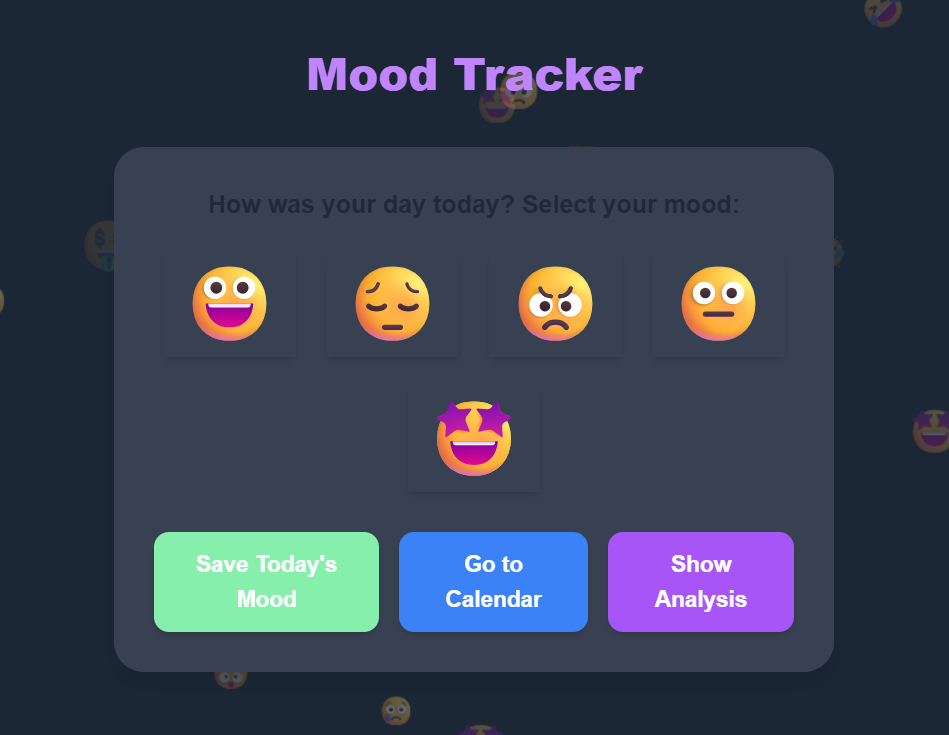
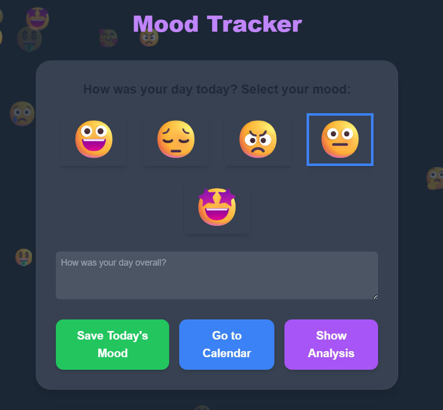
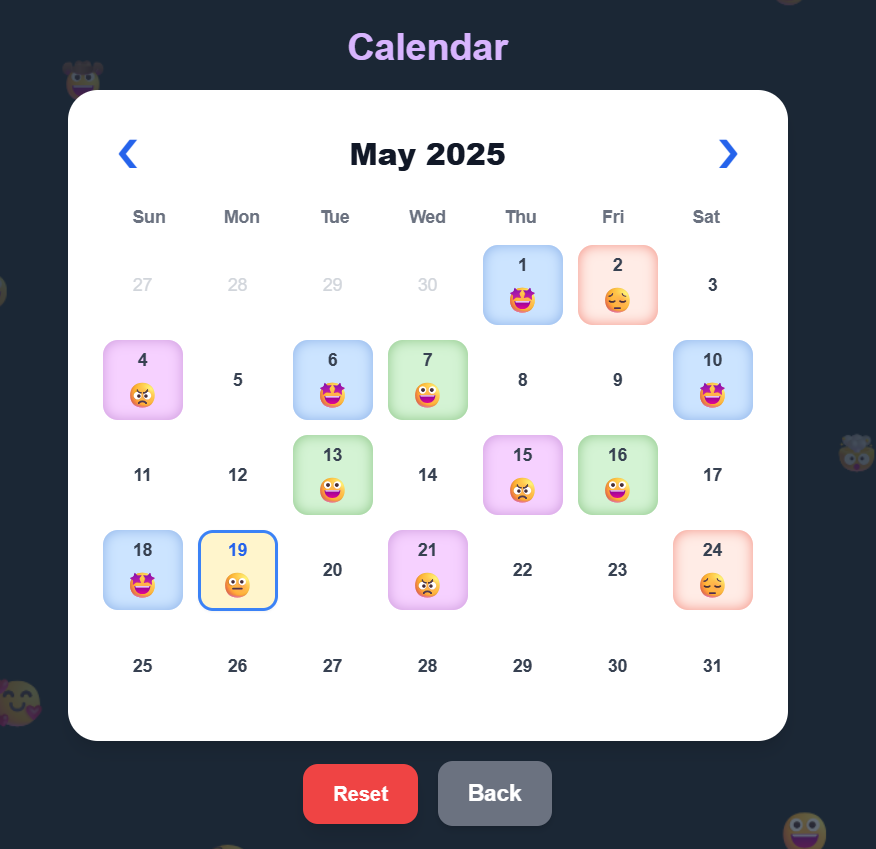
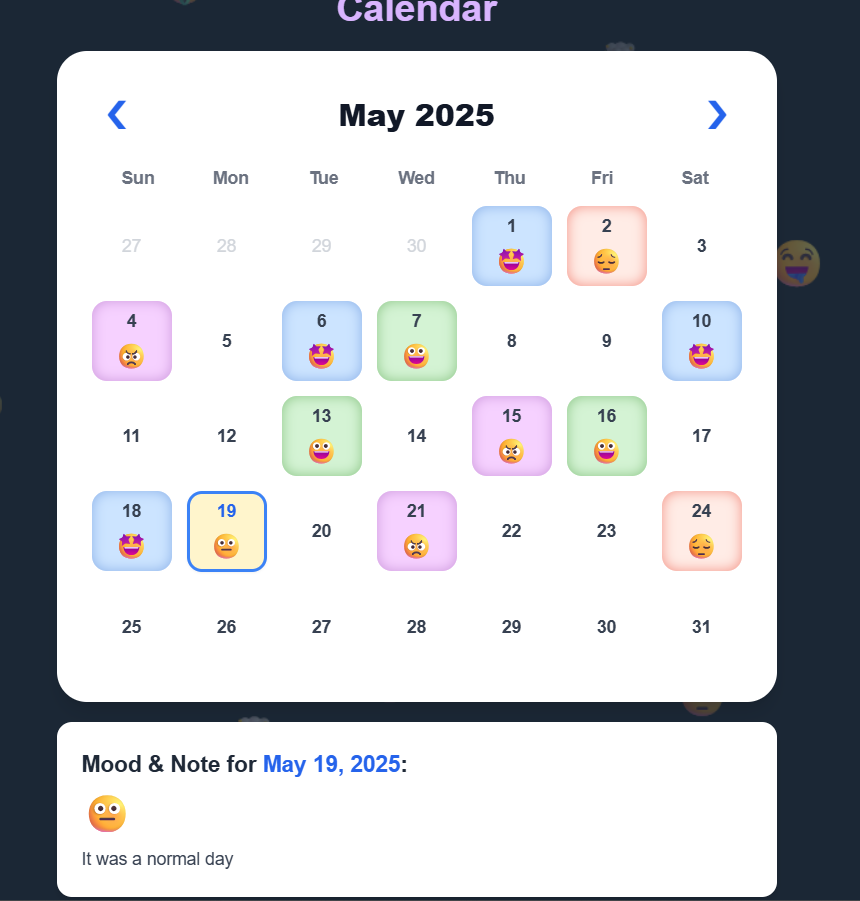
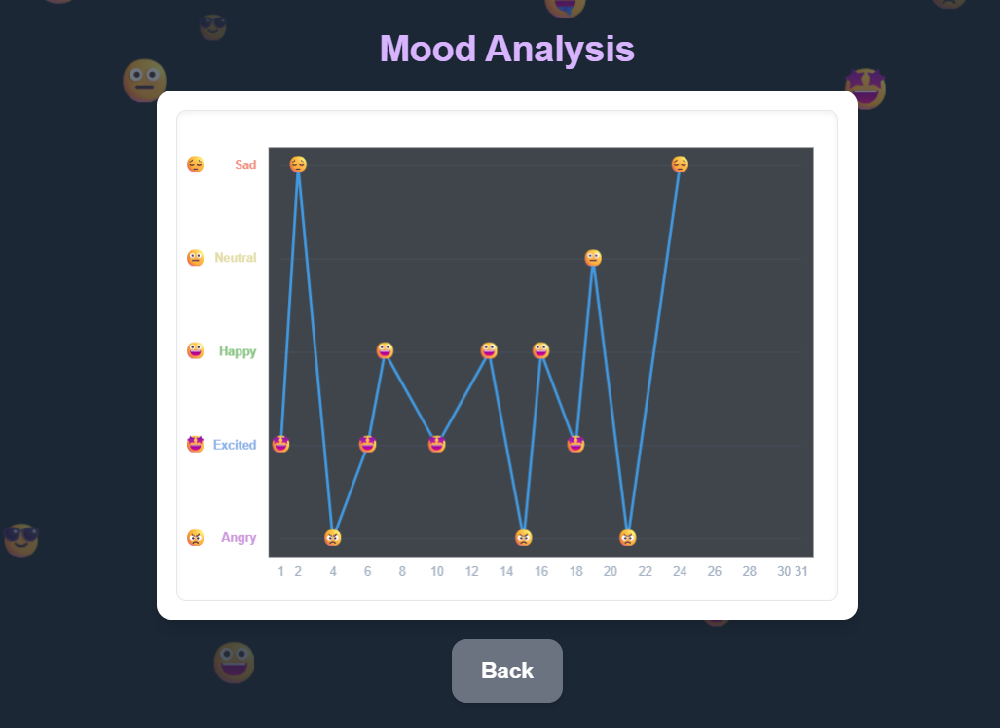

# Mood Tracker Web Application

## 🌟 Overview

This Mood Tracker is a simple yet effective web application designed to help users log their daily moods and **optional notes** using intuitive emoji buttons. Users can visualize their emotional patterns over time through a color-coded calendar and a monthly trend graph. The app also **initializes with sample data** on first use if no prior data exists, allowing for immediate demonstration of its features.

This project was developed as a submission for the CodeCiruit Hackathon by Outlier AI.

## ✨ Features

- **Emoji-Based Mood Input:** Quickly log your mood for the day by selecting from a range of expressive emojis.
- **Optional Daily Notes:**
  - Record thoughts, events, or context alongside your mood entry for the current day.
  - The note input field appears once a mood is selected.
  - Contextual note prompts (placeholders) are provided based on the selected mood.
  - View saved moods and their associated notes by clicking on a day in the calendar.
- **Color-Coded Calendar:** View your mood history at a glance. Each day on the calendar is colored according to the mood logged.
- **Interactive Calendar:**
  - Navigate through different months.
  - Click on a day to view the logged mood and any associated note for that day.
  - Today's date is highlighted.
- **Mood Trend Graph:** Visualize your mood fluctuations for the current month with a line graph.
- **Persistent Storage:** Mood and note data is saved locally in your browser using `localStorage`, so your entries are preserved between sessions.
- **Responsive Design:** The application is designed to be usable across different screen sizes.
- **Animated Emoji Background:** A subtle, dynamic background of floating emojis adds to the visual appeal.
- **Sample Data on First Load:** If no mood data is found, the app populates the last few days with sample entries to showcase functionality.
- **Reset Data:** Option to clear all saved mood data.

## 📸 Screenshots

_Main Mood Input :_

_Calendar View:_

_Analysis Graph:_

## 🛠️ Tech Stack

- **Frontend:** HTML5, CSS3 (with Tailwind CSS for styling), Vanilla JavaScript (ES6+)
- **Storage:** Browser `localStorage`
- **Graphics:** HTML Canvas API for the mood graph and background animation.

## 🚀 Live Demos

- **Vercel:** https://mood-tracker-eight-rho.vercel.app/
- **Netlify:** https://682a3b3e6c5e380008e35536--moodtracker47.netlify.app/
- **GitHub Pages:** https://aksh2758.github.io/mood-tracker/

## 📝 How to Use

1.  **Log Today's Mood & Note:**
    - On the main "Mood Input" section, click the emoji that best represents your mood for the day. The selected emoji will get a blue border.
    - Once a mood is selected, an optional note input field will appear below the emojis. You can type any relevant thoughts or events here. The placeholder text in the note field will change based on the mood you selected.
    - Click the "Save Today's Mood" button. A confirmation ("Today's mood and note have been saved!") will appear. The selected mood and note input will then reset.
2.  **Navigate Sections:**
    - Click "Go to Calendar" to view your mood calendar. The main app title will hide.
    - Click "Show Analysis" to see the mood trend graph for the currently viewed month. The main app title will hide.
    - Use the "Back" buttons (available in the Calendar or Analysis sections) to return to the main "Mood Input" screen. The main app title will reappear.
3.  **Using the Calendar:**
    - The calendar section now has a "Calendar" title.
    - Navigate between months using the `❮` (Previous) and `❯` (Next) arrow buttons at the top of the calendar.
    - Click on any day in the calendar. If a mood was logged for that day:
      - A section below the calendar will appear showing the date, the mood emoji, and any note that was saved with it.
      - If no note was saved, it will indicate that.
      - If no mood was recorded for that day, it will also indicate that.
4.  **View Mood Analysis:**
    - The analysis section now has a "Mood Analysis" title.
    - Click "Show Analysis". The graph displays mood trends for the month currently visible/selected in the calendar.
5.  **Reset Data:**
    - In the Calendar section, click the "Reset" button. A confirmation dialog will appear before all saved mood data is erased.

## 🔮 Future Enhancements (Ideas)

- **Editing notes/moods for past entries** directly from the calendar.
- Ability to log/edit moods for past/future dates directly on the calendar (not just viewing).
- Adding activity/trigger tags.
- Statistics page (e.g., most common mood, mood streaks).
- "Year in Pixels" view.
- Export/Import data functionality.
- Search/filter notes.

## 📜 License

This project is licensed under the MIT License. See the [LICENSE.md](LICENSE.md) file for details.
(You would create a LICENSE.md file with the MIT license text).

---

Thank you for checking out the Mood Tracker!
