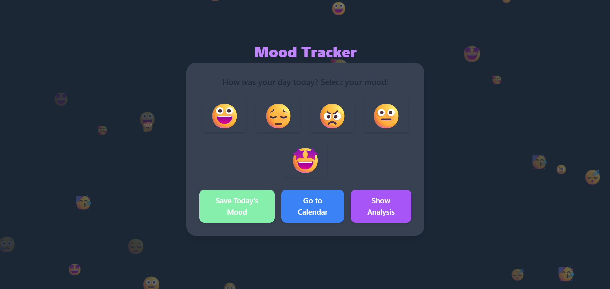
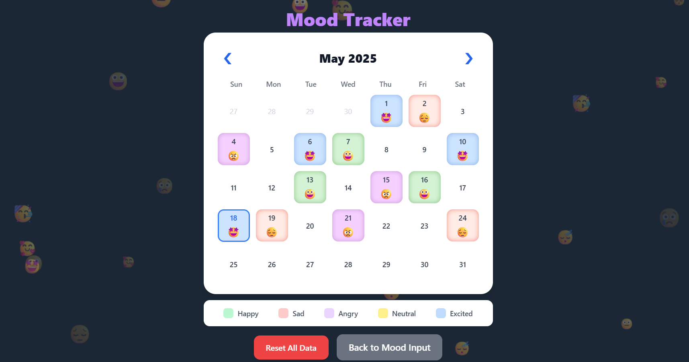

# Mood Tracker Web Application

## 🌟 Overview

This Mood Tracker is a simple yet effective web application designed to help users log their daily moods using intuitive emoji buttons and visualize their emotional patterns over time through a color-coded calendar and a monthly trend graph.

This project was developed as a submission for the CodeCiruit Hackathon by Outlier AI.

## ✨ Features

*   **Emoji-Based Mood Input:** Quickly log your mood for the day by selecting from a range of expressive emojis.
*   **Color-Coded Calendar:** View your mood history at a glance. Each day on the calendar is colored according to the mood logged.
*   **Interactive Calendar:**
    *   Navigate through different months.
    *   Click on a day to log or update its mood.
    *   Today's date is highlighted.
*   **Mood Trend Graph:** Visualize your mood fluctuations for the current month with a line graph.
*   **Persistent Storage:** Mood data is saved locally in your browser using `localStorage`, so your entries are preserved between sessions.
*   **Responsive Design:** The application is designed to be usable across different screen sizes.
*   **Animated Emoji Background:** A subtle, dynamic background of floating emojis adds to the visual appeal.
*   **Reset Data:** Option to clear all saved mood data.

## 📸 Screenshots

*Main Mood Input:*

*Calendar View:*

*Analysis Graph:*

## 🛠️ Tech Stack

*   **Frontend:** HTML5, CSS3 (with Tailwind CSS for styling), Vanilla JavaScript (ES6+)
*   **Storage:** Browser `localStorage`
*   **Graphics:** HTML Canvas API for the mood graph and background animation.

## 🚀 How to Run Locally / View the Project

1.  **Live Demo:**
    You can view the live deployed version here:
   * **GitHub Pages:** https://aksh2758.github.io/mood-tracker/
   *   **Netlify:** https://682a0339e71c3918a07aaab0--moodtracker47.netlify.app/
   *   **Vercel:** https://mood-tracker-eight-rho.vercel.app/

2.  **Running from Source Code:**
    *   Clone the repository: `git clone https://github.com/Aksh2758/mood-tracker.git`
    *   Navigate to the project directory: `cd mood-tracker`
    *   Open the `index.html` file in your preferred web browser.

## 📝 How to Use

1.  **Log Today's Mood:**
    *   On the main "Mood Input" section, click the emoji that best represents your mood for the day. The selected emoji will get a blue border.
    *   Click the "Save Today's Mood" button. A confirmation ("Today's mood has been saved!") will appear.
2.  **Navigate Sections:**
    *   Click "Go to Calendar" to view your mood calendar.
    *   Click "Show Analysis" to see the mood trend graph for the currently viewed month.
    *   Use the "Back to Mood Input" buttons (available in the Calendar or Analysis sections) to return to the main input screen.
3.  **Using the Calendar:**
    *   Navigate between months using the `❮` (Previous) and `❯` (Next) arrow buttons at the top of the calendar.
    *   **To log/update a mood for any day on the calendar:**
        1.  Ensure a mood is selected in the "Mood Input" section (it will have a blue border). You might need to go "Back to Mood Input" to pick or change your active mood.
        2.  Navigate to the "Calendar" section if you aren't there already.
        3.  Click on the desired day in the calendar:
            *   If the day is empty, the selected mood will be applied.
            *   If the day already has a mood, it will be updated to the new mood you selected in the input section.
            *   If you click a day that already has the *same* mood as the one currently selected in the input section, the mood will be *removed* from that day.
4.  **View Mood Analysis:**
    *   Click "Show Analysis". The graph displays mood trends for the month currently visible/selected in the calendar.
5.  **Reset Data:**
    *   In the Calendar section, click the "Reset All Data" button. A confirmation dialog will appear before all saved mood data is erased.

## 🔮 Future Enhancements (Ideas)

*   Adding optional notes to mood entries.
*   Implementing activity/trigger tags.
*   Statistics page (e.g., most common mood, mood streaks).
*   "Year in Pixels" view.
*   Export/Import data functionality.

## 📜 License

This project is licensed under the MIT License. See the [LICENSE.md](LICENSE.md) file for details.
(You would create a LICENSE.md file with the MIT license text).

---

Thank you for checking out the Mood Tracker!
